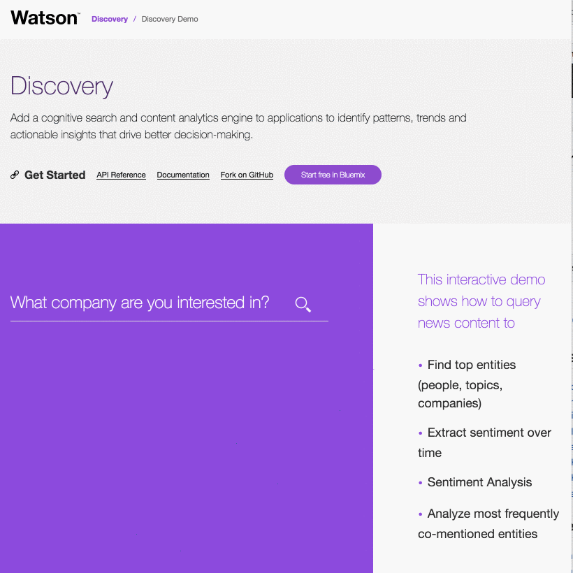

# Discovery Demo


Use the IBM Watson [Discovery][service_url] service to add a cognitive search and content analytics engine to your applications to identify patterns, trends and actionable insights that drive better decision-making.



Demo: https://discovery-news-demo.mybluemix.net/

## Getting started

1. You need a Bluemix account. If you don't have one, [sign up][sign_up].

1. Download and install the [Cloud-foundry CLI][cloud_foundry] tool if you haven't already.

1. Edit the `manifest.yml` file and change `<application-name>` to something unique. The name you use determines the URL of your application. For example, `<application-name>.mybluemix.net`.

  ```yaml
  applications:
  - services:
    - my-service-instance
    name: <application-name>
    command: npm start
    path: .
    memory: 512M
  ```

1. Connect to Bluemix with the command line tool.

  ```sh
  cf api https://api.ng.bluemix.net
  cf login
  ```

1. Create and retrieve service keys to access the [Discovery][service_url] service:

  ```none
  cf create-service discovery standard my-discovery-service
  cf create-service-key my-discovery-service myKey
  cf service-key my-discovery-service myKey
  ```

1. Use the credentials that are returned in step 5 to retrieve the IBM curated News `environment_id` from the list of environments:

  ```none
  curl -X GET -u <username>:<password> https://gateway.watsonplatform.net/discovery/api/v1/environments?version=2016-11-07
  ```

  Output:

  ```json
  {
    "environments": [{
      "created": "2016-11-30T15:41:22.298Z",
      "description": "Watson News cluster environment",
      "environment_id": "bb6ffe96-53d5-44b3-8838-922d4665df8d",
      "index_capacity": {
        ...
      },
      "memory_usage": {
        ...
      },
      "name": "Watson News Environment",
      "read_only": true,
      "status": "active",
      "updated": "2016-11-30T15:41:22.298Z"
    }]
  }
  ```
1. Use the `environment_id` from step 6 to retrieve the IBM curated News `collection_id` from the list of collections:

  ```none
  curl -X GET -u <username>:<password> https://gateway.watsonplatform.net/discovery/api/v1/environments/bb6ffe96-53d5-44b3-8838-922d4665df8d/collections?version=2016-11-07
  ```

  Output:

  ```json
  {
    "collections": [
      {
        "collection_id": "0288e2a0-a1c1-4a38-a376-3c3bd89e927b",
        "description": "Watson News T3 collection",
        "name": "v5-fullnews-t3-2016",
        "configuration_id": "f916ddcd-961e-4668-b46b-2b0f9fe8f002",
        "language": "en_us",
        "status": "active",
        "created": "2016-11-30T15:41:22.318Z",
        "updated": "2016-11-30T15:41:22.318Z"
      }
    ]
  }
  ```
1. Create an `.env` file in the root directory by copying the sample `.env.example` file using the following command:

  ```none
  cp .env.example .env
  ```
  Update the `.env` with your service instace information, your `environment_id`, and your `collection_id` that you retrieved in steps 5 to 7.

  The `.env` file will look something like the following:

  ```none
  DISCOVERY_USERNAME=<username>
  DISCOVERY_PASSWORD=<password>

  DISCOVERY_ENVIRONMENT=<environment>
  DISCOVERY_COLLECTION=<collection>
  ```

1. Install the needed application dependencies with this command:

  ```none
  npm install
  ```

1. Start the application locally:

  ```none
  npm start
  ```

1. Point your browser to [http://localhost:3000](http://localhost:3000).

1. When you're ready, push the application to Bluemix with this command:

  ```none
  cf push
  ```

After completing these steps, you are ready to test your application. Start a browser and enter the URL of your application.

            <your application name>.mybluemix.net


For more details about developing applications that use Watson Developer Cloud services in Bluemix, see [Getting started with Watson Developer Cloud and Bluemix][getting_started].


## Troubleshooting

* The main source of troubleshooting and recovery information is the Bluemix log. To view the log, run this command:

  ```sh
  cf logs <application-name> --recent
  ```

* For more details about the service, see the [documentation][docs] for the Discovery service.


----

### Directory structure

```none
.
├── app.js                      // express routes
├── config                      // express configuration
│   ├── error-handler.js
│   ├── express.js
│   └── security.js
├── manifest.yml
├── package.json
├── public                      // static resources
├── server.js                   // entry point
├── test                        // tests
└── views                       // react components
```

## License

  This sample code is licensed under Apache 2.0.

## Contributing

  See [CONTRIBUTING](.github/CONTRIBUTING.md).

## Open Source @ IBM
  Find more open source projects on the [IBM Github Page](http://ibm.github.io/)

## Privacy Notice

Sample web applications that include this package may be configured to track deployments to [IBM Bluemix](https://www.bluemix.net/) and other Cloud Foundry platforms. The following information is sent to a [Deployment Tracker](https://github.com/IBM-Bluemix/cf-deployment-tracker-service) service on each deployment:

* Node.js package version
* Node.js repository URL
* Application Name (`application_name`)
* Space ID (`space_id`)
* Application Version (`application_version`)
* Application URIs (`application_uris`)
* Labels of bound services
* Number of instances for each bound service and associated plan information

This data is collected from the `package.json` file in the sample application and the `VCAP_APPLICATION` and `VCAP_SERVICES` environment variables in IBM Bluemix and other Cloud Foundry platforms. This data is used by IBM to track metrics around deployments of sample applications to IBM Bluemix to measure the usefulness of our examples, so that we can continuously improve the content we offer to you. Only deployments of sample applications that include code to ping the Deployment Tracker service will be tracked.

[deploy_track_url]: https://github.com/cloudant-labs/deployment-tracker
[cloud_foundry]: https://github.com/cloudfoundry/cli
[getting_started]: https://www.ibm.com/watson/developercloud/doc/common/index.html
[service_url]: http://www.ibm.com/watson/developercloud/discovery.html
[docs]: http://www.ibm.com/watson/developercloud/discovery/
[sign_up]: https://console.ng.bluemix.net/registration/
